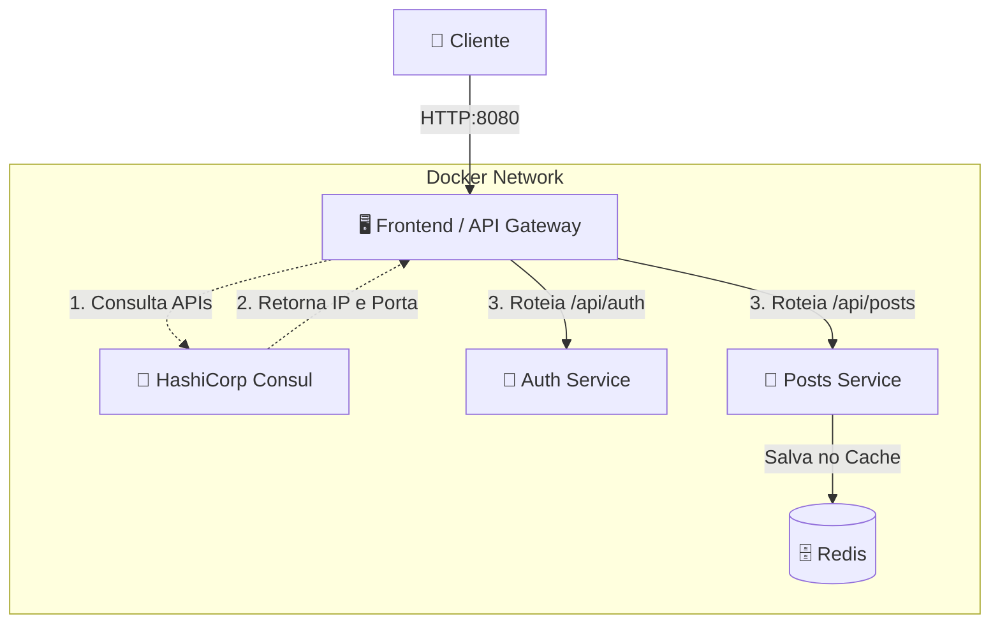
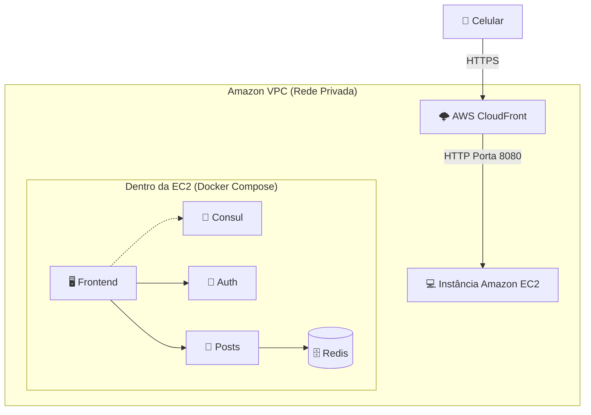
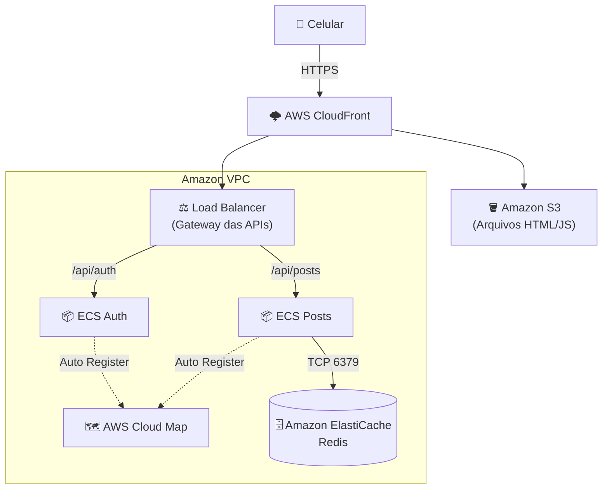

# Service Discovery e Resiliência: Da Arquitetura Local à AWS Cloud Native

**Equipe:**
* Felipe Oliveira Carvalho
* João Pedro de Freitas Gonçalves
* Eduardo Martins
* Wendel Souza
* Gabriel Machado Elias

---

## 1. Stack Tecnológica

O sistema foi construído utilizando um conjunto moderno de tecnologias, visando alta performance e resiliência:

*   **Backend (Microsserviços):** Node.js 22 + TypeScript 5.7, Fastify 5 (Alta performance), ES Modules, e JWT (Autenticação Stateless).
*   **Armazenamento:** Redis 7 para cache do feed em memória.
*   **Frontend (Web e API Gateway):** HTML5 + CSS3 (Glassmorphism), Vanilla JavaScript + Axios.
*   **Infraestrutura e Orquestração:** Docker e Docker Compose, HashiCorp Consul para Service Discovery.

---

## 2. Arquitetura Atual (Docker + Consul)

Atualmente, o ecossistema roda de forma autocontida ("Cloud Agnostic") utilizando contêineres Docker no ambiente de desenvolvimento. O Consul atua como o cérebro da operação.

*   **Cérebro (Consul):** Registra e monitora a saúde dos microsserviços.
*   **Gateway (Frontend):** Descobre dinamicamente onde as APIs estão rodando.
*   **Microsserviços:** Auth e Posts (escaláveis independentemente).

**Benefício:** Portas dinâmicas garantem resiliência. O Frontend nunca aponta para um IP ou porta fixa ("Hardcoded").

### Diagrama Local

---

## 3. Resiliência: Graceful Degradation

A arquitetura foi projetada para suportar falhas parciais de forma graciosa.

**O cenário de falha do Auth Service:**
Se o serviço de autenticação cair, o Consul detecta a falha e avisa o Frontend. Novos logins falharão, mas **o Feed continua rodando!**

**O Segredo: JWT Stateless**
Isso é possível pois o Posts Service valida as sessões ativas (os tokens JWT) localmente, decodificando e verificando a assinatura matemática, sem depender da rede para consultar o Auth Service. O sistema sofre uma "degradação graciosa" em vez de cair por completo.

---

## 4. Redes: Amazon VPC e Docker Network

Antes de migrarmos, é fundamental entender a infraestrutura de rede da nuvem AWS.

A **Amazon VPC (Virtual Private Cloud)** é o equivalente exato da sua `docker network` em nível global e corporativo. 
Assim como o Docker isola os contêineres no seu PC local, a VPC isola os seus recursos na nuvem.

**Comparação Direta:**
*   `docker network` $\rightarrow$ **VPC Subnets**
*   `ports: 8080` $\rightarrow$ **Security Groups**

**Security Groups:** Agem como firewalls. Eles permitem liberar apenas a porta 8080 do Frontend para a Internet (ou para o CloudFront), escondendo todo o restante do ecossistema (Auth, Posts, Consul, Redis) de acessos externos.

---

## 5. A Etapa Intermediária (AWS EC2)

O primeiro degrau na nuvem é o modelo de migração conhecido como *Lift and Shift* (Copiar e Colar). 

Neste cenário, copiamos o nosso ambiente local sem alterar uma única linha de código. Alugamos um servidor virtual (Instância **Amazon EC2**) e rodamos o nosso `docker-compose.yml` intocado dentro dele. O **AWS CloudFront** (CDN Global) se posiciona na frente para fornecer HTTPS, cacheamento e distribuição global.

### Diagrama AWS EC2 (Lift and Shift)

*   **O Problema:** Apesar de rápida, esta abordagem transforma a instância EC2 em um Ponto Único de Falha (SPOF). Se a máquina reiniciar ou os recursos se esgotarem, todo o ecossistema cai.

---

## 6. Evolução: Arquitetura Cloud Native

Para atingir a verdadeira alta disponibilidade, a evolução natural é quebrar o monólito da EC2 e abraçar os serviços gerenciados (*Managed Services*).

O **Amazon ECS (com Fargate)** nos permite rodar contêineres de forma isolada, em um modelo *Serverless* de contêineres.

**Substituições na Nuvem:**
*   **EC2** $\rightarrow$ ECS Fargate (Orquestração Serverless)
*   **Consul** $\rightarrow$ AWS Cloud Map
*   **Redis** $\rightarrow$ Amazon ElastiCache (Gerenciado)

**Escalonamento Real:** Cada API (Auth e Posts) escala de forma autônoma sem precisarmos provisionar o hardware subjacente.

### Diagrama ECS Cloud Native

---

## 7. Discovery Gerenciado (AWS Cloud Map)

No ambiente local e na EC2, o Frontend precisava de código customizado (`axios`) para buscar o registro da API no Consul, configurando um modelo *API-based discovery*.

A arquitetura Cloud Native decreta **o fim do código de descoberta**.

O **AWS Cloud Map** atua como um Service Discovery *Serverless*. Ele substitui o Consul e muda o paradigma para um modelo *DNS-based discovery*. 

**A Magia da Rede (DNS):**
Todo o código complexo que interagia com o Consul pode ser deletado. O Frontend simplesmente chama o serviço como se fosse um domínio amigável (por exemplo, `http://auth.local/api/token`). O resolvedor DNS da própria AWS intercepta essa chamada, descobre inteligentemente qual contêiner do ECS está vivo e roteia os pacotes da requisição. A inteligência saiu do código e foi inteiramente assumida pela infraestrutura da nuvem.
